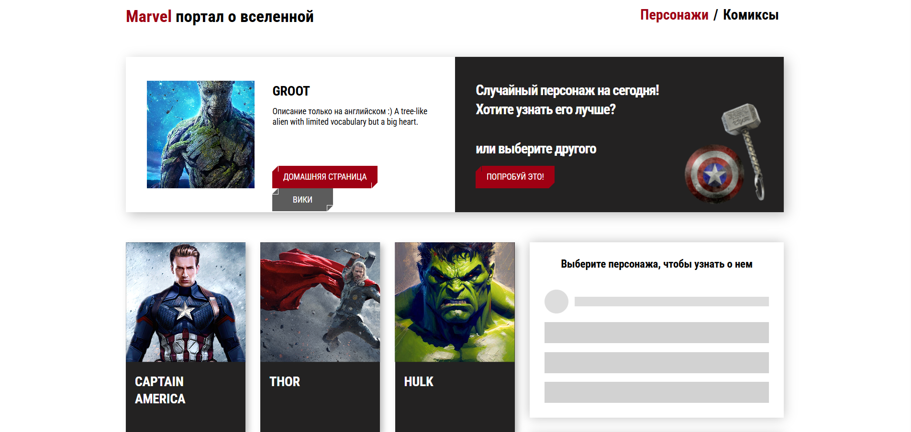
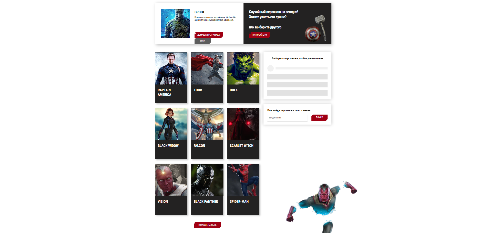
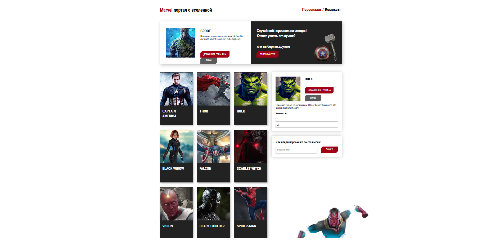
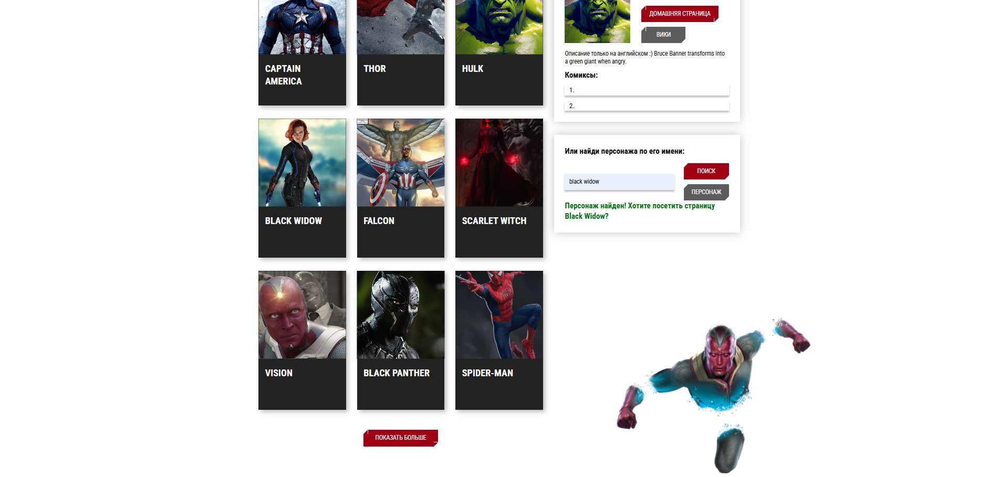
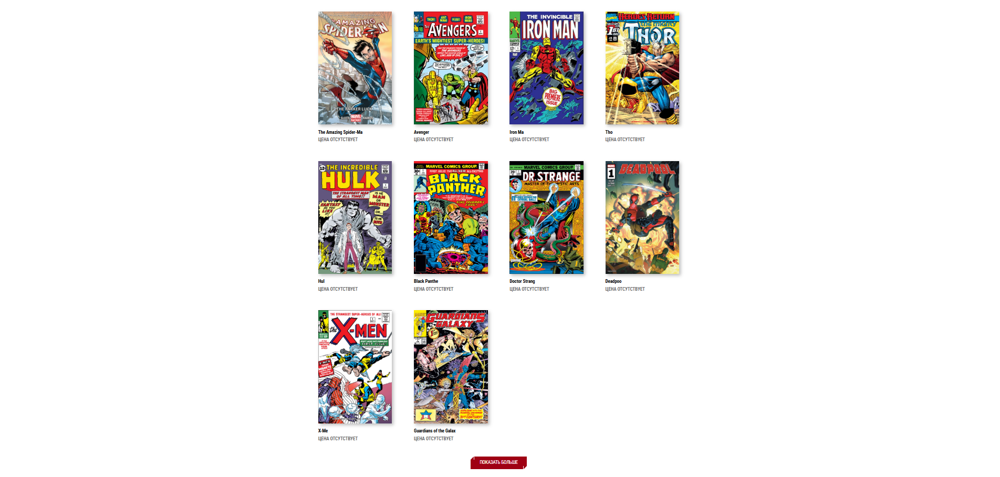
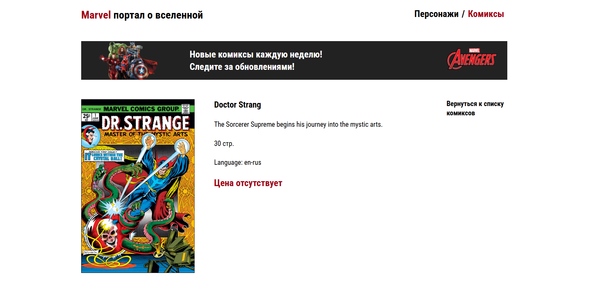

# Структура проекта

**Основные каталоги:**

```
public/
src/
    assets/
        components/
            app/
            appBaner/
            appContent/
            appHeader/
            charInfo/
            charList/
            charSearchForm/
            comicList/
            errorBoundary/
            errorMessage/
            pages/
                singleCharacterPages/
                singleComicPages/
            randomChar/
            singleComic/
            skeleton/
            spinner/
        hooks/
        resources/
        services/
        style/
        utils/
index.html

```

=======

# Marvel-about-Portal (Vite + React)








## О проекте

Portal about Marvel — приложение, посвященное Вселенной Марвел. Приложение предоставляет пользователю сервер (Marvel's API) для загрузки персонажей/комиксов. Пользователь также может выбирать случайного персонажа, искать конкретного персонажа и переходить на страницы персонажа на Википедии или на marvel.com. Проект написан на React.

## Технологии

- Vite 7
- React 19 (функциональные компоненты)
- SCSS
- Marvel's API (использование сервера для загрузки комиксов и персонажей)

## Установка и запуск

```bash
git clone https://github.com/NikRNN/Portal-about-Marvel.git
cd Portal-About-Marvel
npm install
npm run dev

```
